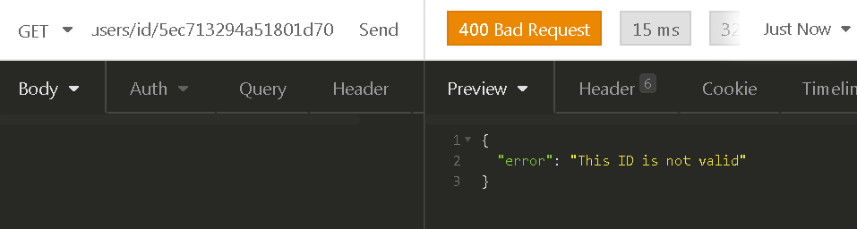

# Node.js + MongoDB API

Essa é uma API REST que desenvolvi para um desafio, e que faz a gestão de uma base de usuários no banco de dados.

## Tecnologias utilizadas :rocket:

 - [Node.js](https://nodejs.org/pt-br/) utilizando o framework [Express](https://expressjs.com/pt-br/)
 - [Mongoose.js](https://mongoosejs.com/) para a interação com o banco de dados
 - [MongoDB](https://www.mongodb.com/) como o banco de dados

## O que aprendi com este projeto :dart:

Além de ter praticado meus conhecimentos em Javascript com Node.js, também pude aprender a interagir com o banco de dados não relacional MongoDB, o qual nunca tinha usado antes desse projeto, gostei bastante do banco pois muitas coisas são mais simples do que em bancos relacionais, com certeza vou continuar adquirindo conhecimentos sobre MongoDB.
   
## Como testar a API em sua máquina :arrow_forward:

Para testá-la, você precisará ter instalado em seu computador o [Git](https://git-scm.com), o [Node.js/NPM](https://nodejs.org/pt-br/), o [MongoDB](https://youtu.be/skK5xj-CK-Q) e algum software que possa testar APIs, eu recomendo o [Insomnia](https://insomnia.rest/download/) pois ele é muito fácil de se usar, simples e eficaz, baixe a versão Insomnia Core!

Passo a passo para testar a aplicação:
1. Vá em algum diretório do seu computador, e abra o Git Bash clicando com o botão direito do mouse no diretório que você escolheu, e escolha a opção "Git Bash Here", após isso siga os seguintes passos:

### Baixando o projeto
```bash
# Clone o repositório
$ git clone https://github.com/TiagoDiass/node-mongo-api.git

# Entre na pasta do repositório
$ cd node-mongo-api
```

2. Eu preparei algumas seeds para que você possa testar a API sem ter que ficar registrando dados manualmente, então, nós vamos instalar as dependências da API, inicar o servidor do MongoDB, executar as seeds e então depois disso vamos iniciar a API. Abra uma outra janela do terminal para iniciar o MongoDB no segundo passo abaixo, para isso aperte <kbd>Windows</kbd>+<kbd>R</kbd>, digite "cmd" e dê um <kbd>ENTER</kbd>, e então siga os passos abaixo: 

### Instalando as dependências e iniciando a API
```bash
# No terminal Git Bash, instale as dependências
$ npm install 

# No CMD aberto para iniciar o servidor do MongoDB, execute o seguinte comando para iniciar o servidor:
$ mongod

# Após isso, volte ao Git Bash e execute os passos abaixo

# Executando as seed para criação de alguns dados automáticos(após executar as seed aperte CTRL+C para fechá-la)
$ npm run seed

# Após ter instalado as dependências e executado as seeds, inicie a aplicação
$ npm start
```

3. Abra o Insomnia e siga estes passos:

      - Para testar a API no Insomnia, você pode começar criando um workspace clicando na setinha branca ao lado do nome do seu workspace atual, e dar a ele o nome que você quiser, nesse caso eu coloquei "Node Mongo CRUD".

      - Após isso você pode criar as requests/requisições, seguindo os seguintes passos, caso queira trocar o nome de alguma delas você pode, o importante é que você preste atenção ao método HTTP que está dando ao criar cada uma das requests, se baseie nos metódos que estão a esquerda dos nomes das requisições no print abaixo :arrow_heading_down:
      
      
      
      - <strong>Você pode criar as rotas baseando-se na tabela abaixo</strong> :arrow_heading_down:
      
<table>
  <tr>
    <th>Nome da requisição</th>
    <th>Método HTTP</th>
    <th>Rota</th>
    <th>Tipo do corpo</th>
    <th>Instruções</th>
  </tr>
  
  <tr>
    <td>List all users</td>
    <td>GET</td>
    <td>http://localhost:3333/users</td>
    <td>No body (sem corpo)</td>
    <td>Nenhuma</td>
  </tr>
  
  
  <tr>
    <td>Get user by ID</td>
    <td>GET</td>
    <td>http://localhost:3333/users/id/:userID</td>
    <td>No body (sem corpo)</td>
    <td>Para utilizar essa requisição, coloque o ID de um usuário no lugar do <strong>:userID</strong></td>
  </tr>
  
  <tr>
    <td>Get user by CPF</td>
    <td>GET</td>
    <td>http://localhost:3333/users/cpf/:userCPF</td>
    <td>No body (sem corpo)</td>
    <td>Para utilizar essa requisição, coloque o CPF de um usuário no lugar do <strong>:userCPF</strong></td>
  </tr>
  
  <tr>
    <td>Create user</td>
    <td>POST</td>
    <td>http://localhost:3333/users/new</td>
    <td><strong>JSON</strong></td>
    <td>Veja um exemplo da utilização dessa requisição abaixo</td>
  </tr>
  
  
  <tr>
    <td>Edit user</td>
    <td>PATCH</td>
    <td>http://localhost:3333/users/:userID</td>
    <td><strong>JSON</strong></td>
    <td>Veja um exemplo da utilização dessa requisição abaixo</td>
  </tr>
  
  <tr>
    <td>Delete user</td>
    <td>DELETE</td>
    <td>http://localhost:3333/users/:userID</td>
    <td>No body (sem corpo)</td>
    <td>Para utilizar essa requisição, coloque o ID de um usuário no lugar do <strong>:userID</strong></td>
  </tr>
</table>
  
## Testando a API :on:

Após ter criado todas as requisições, você pode começar a testá-las, o funcionamento da API é bem simples, através das requisições, você pode salvar, editar, mostrar e excluir dados de usuários na base de dados.<br>

Como você executou a seed, alguns registros já estarão no banco de dados

#### Agora irei mostrar os possíveis resultados e retornos da API

### Requisição LIST ALL USERS: 

Como o nome da requisição já diz, ela irá listar todos os registros de usuários que estão no banco de dados, esse é o resultado ao executá-la(ah, e para executá-la, basta clicar no botão SEND, isso irá enviar a requisição para API) :arrow_heading_down:


### Requisição GET USER BY ID: 

Essa requisição irá mostrar os dados de um usuário específico, para utilizá-la você deve colocar o ID do usuário que você deseja ver os dados na rota/endereço da requisição como eu mostrei na tabela das requisições acima :arrow_heading_up: <br>
Caso você já tenha criado a requisição, veja as imagens abaixo para tomar como exemplo :arrow_heading_down:

Caso o ID seja inválido, o resultado será o seguinte:



Caso o ID seja válido, mas não esteja cadastrado no banco, o resultado será o seguinte:


E finalmente caso o ID esteja cadastrado no banco, o resultado será os dados do usuário que foi especificado pelo ID, como na imagem abaixo:


### Requisição GET USER BY CPF: 

Essa requisição irá mostrar os dados de um usuário específico, para utilizá-la você deve colocar o CPF do usuário que você deseja ver os dados na rota/endereço da requisição como eu mostrei na tabela das requisições acima :arrow_heading_up: <br>
Caso você já tenha criado a requisição, veja as imagens abaixo para tomar como exemplo :arrow_heading_down:

Caso o CPF seja inválido, o resultado será o seguinte:


E finalmente caso o CPF esteja cadastrado no banco, o resultado será os dados do usuário que foi especificado pelo CPF, como na imagem abaixo:


### Requisição CREATE USER: 

Essa é a requisição responsável por adicionar um novo usuário aos registros, para utilizá-la você deve preencher o corpo da requisição com os seguintes dados: 
<table>
  <tr>
    <th>Nome do campo</th>
    <th>Valores esperados</th>
    <th>Obrigatório?</th>
  </tr>
  
  <tr>
    <td>name</td>
    <td>Strings, não vazias</td>
    <td>SIM</td>
  </tr>
  
  <tr>
    <td>cpf</td>
    <td>Strings, somente com números, e com 11 dígitos</td>
    <td>SIM</td>
  </tr>
  
  <tr>
    <td>email</td>
    <td>Strings, que sejam e-mails válidos, um texto simples não será aceito</td>
    <td>SIM</td>
  </tr>
  
  <tr>
    <td>phone</td>
    <td>Strings, somente com números, com 10 ou 11 dígitos</td>
    <td>SIM</td>
  </tr>
  
  <tr>
    <td>address</td>
    <td>objeto, com os atributos como nas imagens e tabela abaixo dessa :arrow_heading_down: </td>
    <td>SIM(exceto o campo complement)</td>
  </tr>
  
  <tr>
    <td>birthdate</td>
    <td>Strings, no formato DIA/MÊS/ANO, e que sejam de maior de 18 anos</td>
    <td>SIM</td>
  </tr>
  
  <tr>
    <td>gender</td>
    <td>String "M", "F", ou "N/A", sendo que "N/A" é o valor default caso não seja informado na requisição</td>
    <td>NÃO</td>
  </tr>
  
</table>

### Atributos do address

<table>
  <tr>
    <th>Nome do campo</th>
    <th>Valores esperados</th>
    <th>Obrigatório?</th>
  </tr>
   
  <tr>
    <td>complement</td>
    <td>Strings</td>
    <td>NÃO</td>
  </tr>
  
  <tr>
    <td>street</td>
    <td>Strings não vazias</td>
    <td>SIM</td>
  </tr>
  
  <tr>
    <td>number</td>
    <td>Números maiores do que 0</td>
    <td>SIM</td>
  </tr>

  <tr>
    <td>neighborhood</td>
    <td>Strings não vazias</td>
    <td>SIM</td>
  </tr>
  
  <tr>
    <td>city</td>
    <td>Strings não vazias</td>
    <td>SIM</td>
  </tr>
  
  <tr>
    <td>state</td>
    <td>String de 2 dígitos que sejam algum estado do Brasil, como "SP", ou "RJ"...</td>
    <td>SIM</td>
  </tr>
  
  <tr>
    <td>country</td>
    <td>Strings não vazias</td>
    <td>SIM</td>
  </tr>
  
  <tr>
    <td>zipcode</td>
    <td>Strings que contenham somente números que tenham 8 dígitos</td>
    <td>SIM</td>
  </tr>
</table>

Você pode ver o exemplo nas imagens abaixo, após adicionar o usuário, a resposta da requisição será os dados do usuário que você adicionou :arrow_heading_down: <br>

Caso algum dado esteja inválido, a resposta indicará qual campo está errado, como na imagem abaixo que o campo birthday é uma data onde a pessoa seria menor de 18 anos:


Ou como na imagem abaixo, onde vemos que o campo e-mail está com um e-mail inválido:


Caso os dados estejam válidos, a resposta será os dados do usuário criado, como na imagem abaixo:


### Requisição UPDATE USER:

Essa é a requisição responsável por editar os dados de um usuário, para utilizá-la você deve colocar o ID do usuário na rota/endereço da requisição(como na primeira tabela acima), e no corpo da requisição você deve colocar o nome do campo que deseja alterar e seu respectivo valor, consulte a tabela acima caso precise de ajuda :arrow_heading_up: <br>
Você pode seguir o exemplo na imagem abaixo, após editar o usuário, a resposta da requisição serão os novos dados do usuário que você editou, veja abaixo :arrow_heading_down:

Caso o ID passado como parâmetro não exista no banco de dados, a resposta será assim:


Caso algum dado esteja inválido, a resposta indicará qual campo está errado, como na imagem abaixo:


Caso os dados escolhidos estejam válidos, a resposta serão os novos dados do usuário editado, como na imagem abaixo:


### Requisição DELETE: 

Essa é a requisição responsável por deletar um usuário, o resultado da requisição será um corpo vazio e o status 204(que significa "No content", sem conteúdo), para utilizar a requisição DELETE você deve colocar o ID do usuário na rota(como mostrei na primeira tabela), veja as imagens abaixo :arrow_heading_down:

Caso o ID passado como parâmetro não exista no banco de dados, a resposta será assim:


Caso o ID passado seja válido, a resposta será a seguinte:


<hr>

### Como parar a aplicação:

Após ter testado ela, você pode parar o seu funcionamento voltando ao terminal Git Bash que você utilizou para iniciar a API, e apertar <kbd>CTRL</kbd>+<kbd>C</kbd>, após isso a API será parada e você não conseguirá mais testá-la enquanto você não a iniciar novamente, após isso você pode ir no CMD onde você iniciou o servidor do MongoDB e apertar <kbd>CTRL</kbd>+<kbd>C</kbd> , após isso o servidor do MongoDB também será desligado :)

#### Contato
- [Linkedin](https://www.linkedin.com/in/tiagodiass)
- Email: tiago.costadiasss@gmail.com

##### Espero que tenha gostado do projeto :smiley:
